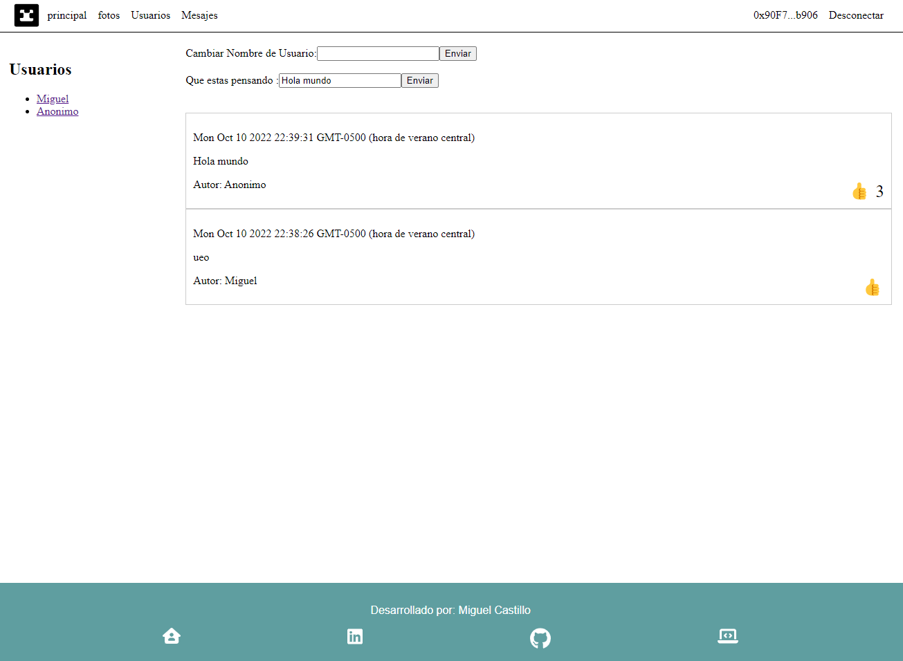

  

**Puedes ver el resultado en:** [r32mcastillo.github.io/eth-blog/](r32mcastillo.github.io/eth-blog/).
<!-- About the Project -->
## :star2: Blog creado en solidity

  

 

Conecta con tu MetaMask a la tesnet de Goerli y deja algunos mensajes =)

 

**Recursos.**
- [Platzi - Curso de Dapps: Introducción al Desarrollo de Aplicaciones Descentralizadas](https://platzi.com/cursos/intro-dapps/)
- [Platzi - Curso de Desarrollo Frontend de Aplicaciones Descentralizadas con Web3.Js](https://platzi.com/cursos/frontend-dapps/)
- [Platzi - Curso de Arquitectura de Aplicaciones Descentralizadas en Ethereum](https://platzi.com/cursos/arquitectura-dapps/)

**Puedes ver el resultado en:** [r32mcastillo.github.io/eth-blog/](r32mcastillo.github.io/eth-blog/).

